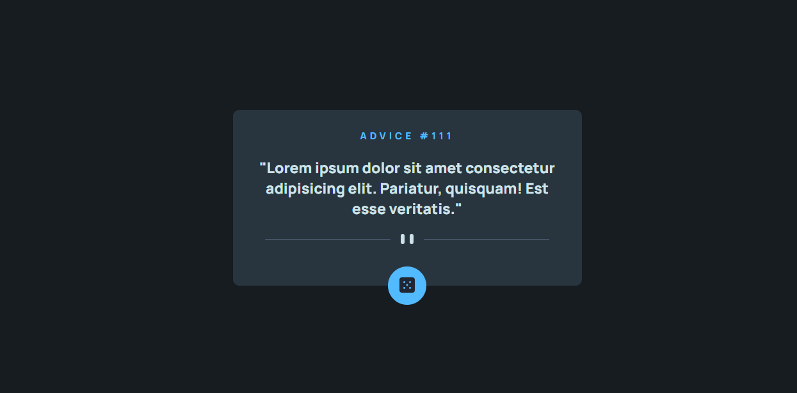
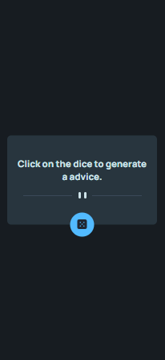

# Projeto Profile Card 🎴

### Desafio do curso DevQuest (adaptado do Frontend Mentor) onde o principal objetivo é construir um aplicativo que gere conselhos aleatórios.

### O projeto precisa rodar tanto em desktop como mobile, sem usar media query.

#

## Design Desktop

[]

## Design Mobile

[]

## Tecnologia utilizadas:

- HTML
- CSS
