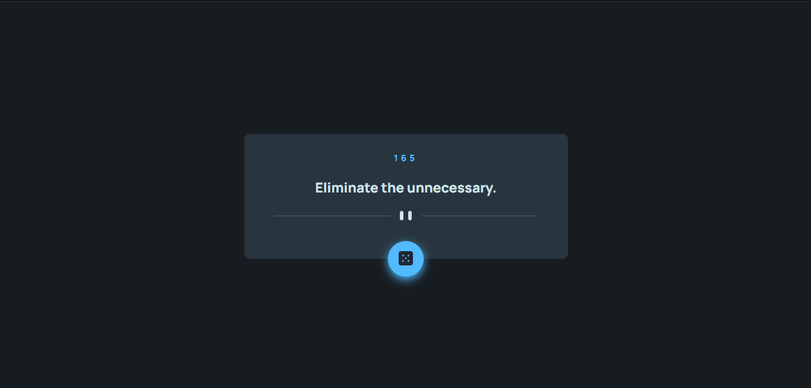

# Projeto Advice Gerenator 💬

## Objetivos:

- Desafio do curso DevQuest (adaptado do Frontend Mentor) onde o principal objetivo é construir um aplicativo que gere conselhos aleatórios;

- O projeto precisa rodar tanto em desktop como mobile, sem usar media query;

- Precisamos consumir API de conselhos e atualizar conteúdo de ID e descrição do conselho através de innerHTML;

- Por fim, precisamos atribuir a função para gerar os conselhos através do botão com Eventlistener.

## Design Desktop

[]

## Design Desktop Active

[]

## Design Mobile

[]

## Tecnologia utilizadas:

- HTML
- CSS
- JavaScript

#
#### Create by: Osmar Viana